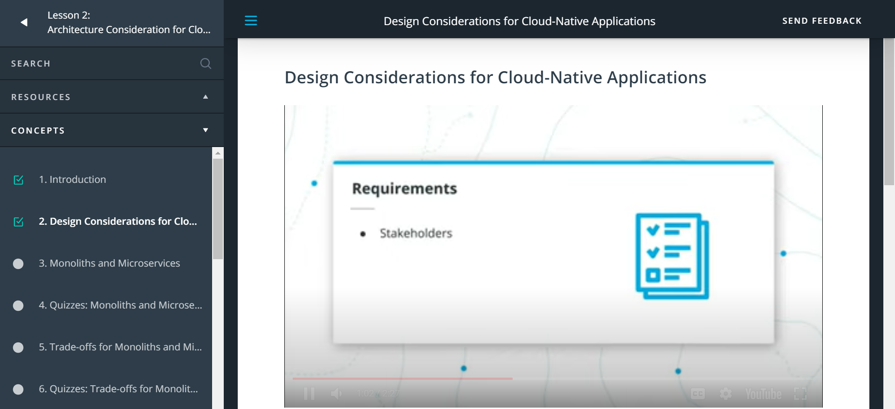
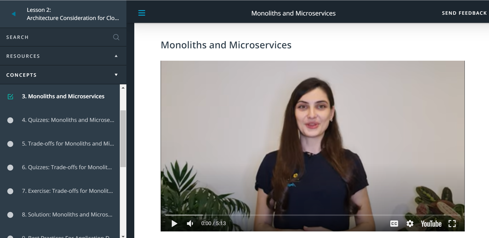
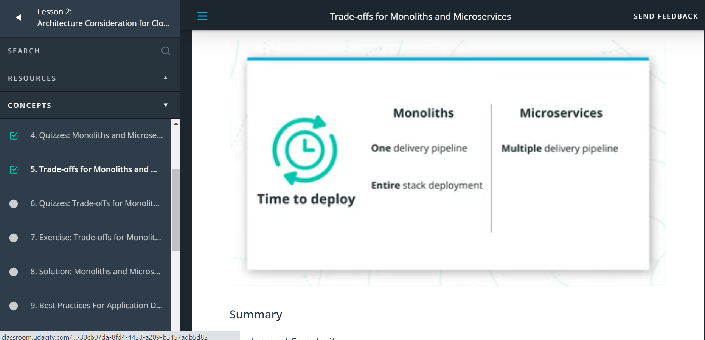
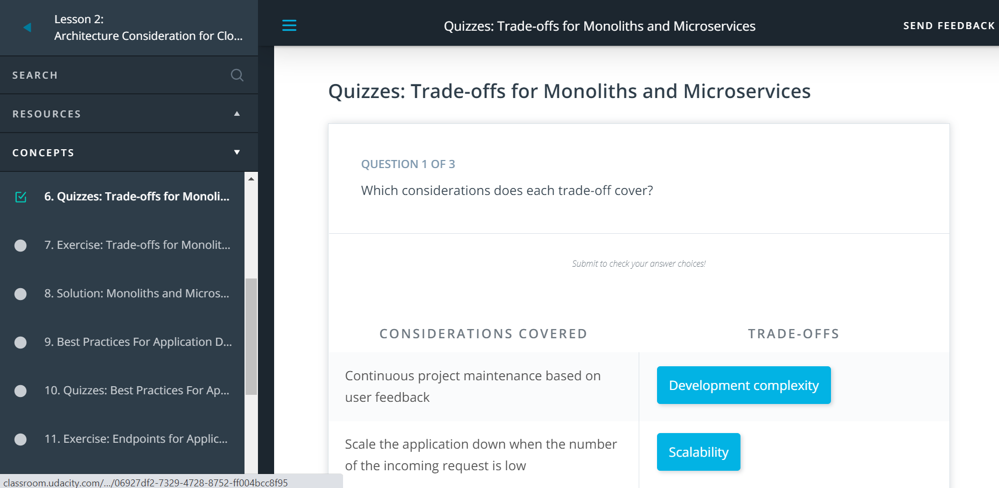

# Cloud Native Fundamentals Scholarship Program of Phase-I
This repo contains all the information related to Cloud Native Fundamentals Scholarship Program of Phase-I.

## Day 1: June 26, 2021. #daily_scrum
- My current progress is:\
  **Lesson 1. Introduction to Cloud Native Fundamentals** (Progress 6%)
    - **Meet Your Mentors** (Progress 7%)
    - **Prerequisites**

## Day 2: July 27, 2021. #daily_scrum
- My current Overall progress : 20%\
  **Lesson 2. Architecture Consideration for Cloud-Native Applications** (Progress 38%)
    - **Introduction** 
    - **Design Considerations for Cloud-Native Applications**
    - **Monoliths and Microservices**
    - **Quizzes: Monoliths and Microservices**

## Day 3: July 27, 2021. #daily_scrum
- My current Overall progress : 22%\
  **Lesson 3. Architecture Consideration for Cloud-Native Applications** (Progress 50%)
    - **Trade-offs for Monoliths and Microservices** 
    - **Quizzes: Trade-offs for Monoliths and Microservices**

